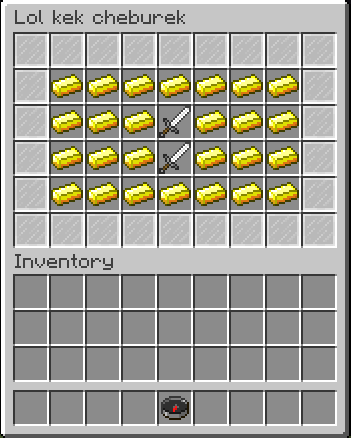

# GuiAPI
 Simple spigot gui API for creating menus
 Based on my Bedrock Edition Nukkit plugin https://github.com/Ragnok123/MenuAPI
 
## Supported menus
 [x] Inventory menu
  
## Features:
	- it's simple to use
	- category api for quick switching content
	- supports string menu convetror
	
Example:
```
String[] mainMenu = new String[] {
					"xxxxxxxxx",
					"xvvvvvvvx",
					"xvvvgvvvx",
					"xvvvgvvvx",
					"xvvvvvvvx",
					"xxxxxxxxx"
			};
			String[] blockMenu = new String[] {
					"xxxxxxxxx",
					"x       x",
					"x   g   x",
					"x   g   x",
					"x       x",
					"xxxxxxxxx"
			};
			
			InventoryMenu menu = new InventoryMenu();
			menu.setName("Lol kek cheburek");
			menu.setRowSize(6);
			menu.setMainCategory(new InventoryCategory() {{
				HashMap<Character, ItemData> lmao = new HashMap<Character, ItemData>();
				lmao.put('x', new ItemData(Material.STAINED_GLASS_PANE));
				lmao.put('v', new ItemData(Material.GOLD_INGOT));
				lmao.put('g', new ItemData(Material.IRON_SWORD));
				
				HashMap<Character, ItemClick> l = new HashMap<Character, ItemClick>();
				l.put('g', new ItemClick() {
					public void onClick(Player player, ItemStack item) {
						menu.openCategory("blocks", player);
					}
				});
				
				setStringElements(mainMenu, lmao, l);
			}});
			menu.addCategory("blocks", new InventoryCategory() {{
				HashMap<Character, ItemData> lmao = new HashMap<Character, ItemData>();
				lmao.put('x', new ItemData(Material.STAINED_GLASS_PANE));
				lmao.put('g', new ItemData(Material.IRON_SWORD));
				
				HashMap<Character, ItemClick> l = new HashMap<Character, ItemClick>();
				l.put('g', new ItemClick() {
					public void onClick(Player player, ItemStack item) {
						menu.openMainCategory(player);
					}
				});
				setStringElements(blockMenu, lmao, l);
			}});
			menu.setOnlyRead(true);
			menu.show(player);
```
 
